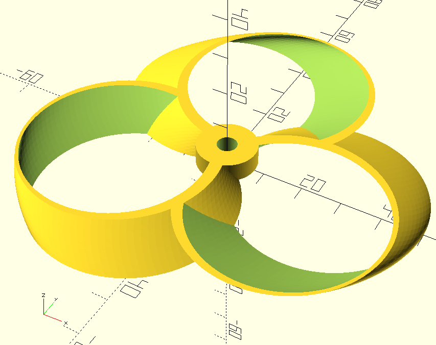

# 2023-m2-bdrthermea

## Important

To clone this repository, use the following command:

```bash
git clone https://github.com/master-csmi/2023-m2-bdrthermea.git
```

## Description of Mesh_fan_generation folder

This folder contains four python files using the SALOME API to generate a mesh of a fan.

The ``propeller_boat.py`` file generates a mesh of a propeller boat. It is based from [this paper](http://www.ship-research.com/cn/article/doi/10.19693/j.issn.1673-3185.03419).

The ``Cylinder_toroidal_propeller.py`` file generates a mesh of a toroidal propeller. It's an adaptation of [this github repository](https://github.com/RaulBejarano/Ultimate-Toroidal-Propeller-Generator/tree/main) to the SALOME API. The original repository made the mesh using OpenSCAD. More specifically, the ``Cylinder_toroidal_propeller.py`` file is an adaptation of the ``configurable.PNG`` mesh that you can see below.



The ``propeller_own_equation.py`` file generates a mesh of a propeller using our own equation. You can find the equation in the report located in the ``Documentation/Sacha``
folder.

The ``toroidal_cad.py`` file generates a 3D model of a toroidal fan using only the SALOME API. The model was inspired by this video.

[](https://www.youtube.com/watch?v=UUPffl7JxKw)

Finally, you can find a subfolder called ``Toroidal_blade``, it contains three models of toroidal fans stored in the ``.step`` format. You can open them with SALOME. The ``Deeper_Full_Geometry.step`` file is a model of a toroidal fan with a deeper blade. The ``NACA_Variation_Full_Geometry.step`` file is a model of a toroidal fan with a variation of the NACA profile. The ``Normal_Full_Geometry.step`` file is a model of a toroidal fan with a normal blade.

## How to generate the meshes

To generate the meshes, you need to have SALOME installed on your computer. You can download it [here](https://www.salome-platform.org/downloads/previous-versions/salome-v9.7.0).

Once you have SALOME installed, you must clone this repository and open your terminal.

Next go to the folder where you installed SALOME.

Then, you can launch SALOME with the following command:

WINDOWS:

```bash
run_salome.bat
```

UBUNTU 20.04:

```bash
./salome
```

To execute one of the python files, add this to your command:

WINDOWS:

```bash
run_salome.bat <path_to_the_python_file>
```

UBUNTU 20.04:
    
```bash
./salome -t <path_to_the_python_file>
```

_________________

## Multiphysics Modeling Project

### Overview
This project aims to calibrate heat pump models using two different optimization algorithms: Particle Swarm Optimization (PSO) and the Non-dominated Sorting Genetic Algorithm II (NSGA-II). The calibration process adjusts simulation parameters to closely match real-world data, enhancing the accuracy of heat pump simulations. The `multi-physics-modeling` folder contains all the code and documentation for the project.

### Code Organization

The project is organized within the `multi-physics-modeling` directory, encompassing all necessary code and documentation:

- **src:** This directory hosts the main computational notebooks and the simulation class file.
  - `calibration_pso.ipynb`: Implements the Particle Swarm Optimization (PSO) method for calibrating heat pump models.
  - `calibration_nsga2.ipynb`: Utilizes the Non-dominated Sorting Genetic Algorithm II (NSGA-II) for calibration purposes.
  - `simulation_class.py`: Contains the `HeatPumpSimulator` class, crucial for simulating the heat pump's functionality within both calibration notebooks.

### Dependencies


Ensure you have Python 3.10.12 installed. You can install all required libraries using pip. Here is a command to install all the dependencies:

```bash
pip install openpyxl pandas numpy matplotlib pyswarm pymoo
```

Ensure that the `simulation_class` module is accessible by placing it in the same directory as the notebooks or configuring your PYTHONPATH accordingly.

### Documentation

The `report` folder contains the presentation and report in pdf format and the latex files.


## Automatic Model Validation of Heat Pumps

### Description

This project aims to automate the validation of heat pump models using Azure DevOps pipelines, focusing on converting Modelica `.mo` files into Functional Mock-up Units (`.fmu`) and validating these models against empirical data. By automating this process, we strive to enhance the efficiency, accuracy, and reliability of heat pump system modeling.


### Prerequisites

- Azure DevOps account
- Access to BDR Thermea's Azure DevOps repositories
- Dymola software with a valid license

### Features

- **Automated Model Conversion**: Utilizes Dymola commands within Azure DevOps pipelines to automatically convert `.mo` files to `.fmu` format.
- **Model Validation**: Automatically validates converted models against empirical data to ensure accuracy.
- **Pipeline Integration**: Incorporates model validation processes into Azure DevOps pipelines for continuous integration.
- **Error Analysis**: Implements methods to calculate the error margin between simulation results and empirical data.

### Setup

1. **Configure Azure DevOps Pipelines:** Follow the `.yml` files provided in the repository `Pipelines` to set up your Azure DevOps pipelines.

2. **Dymola Configuration:** Ensure that Dymola is properly installed and licensed on the machine where the pipelines will be executed.
